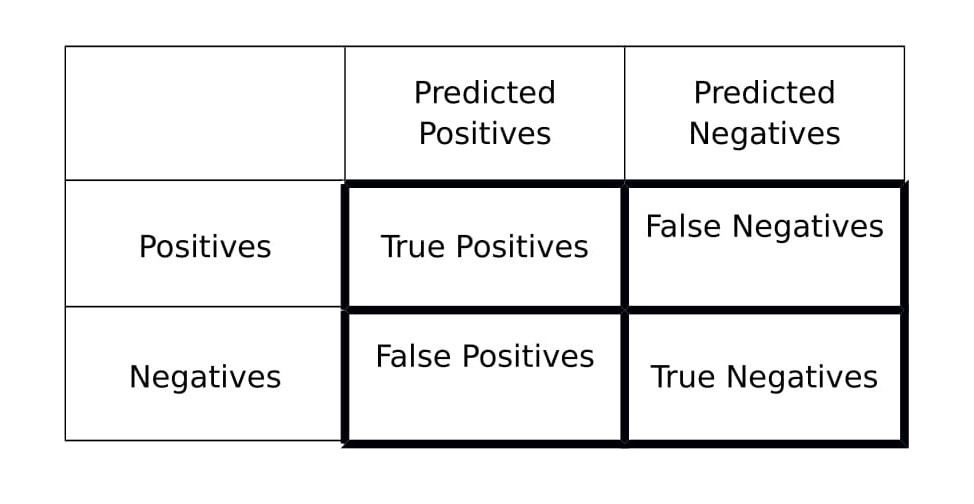
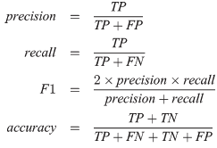

# Real ou Não - NLP com tweets sobre desastres

O Twitter se tornou um importante canal de comunicação em tempos de emergência. A onipresença dos smartphones permite que as pessoas anunciem uma emergência que estão observando em tempo real. Por esse motivo, mais agências estão interessadas em monitorar programaticamente o Twitter (ou seja, organizações de auxílio a desastres e agências de notícias).

A predição envolve uma classificação de um determinado conteudo do tweet se contém uma noticia sobre desatre real ou não.

  

## Afim de compartilhar conhecimento e testar os meus conhecimentos adquiridos :heart: .

## Abordando modelos classicos e redes neurais

## O modelo usado para a validação usará as medricas a seguir 

  

## As formulas utilizadas serão essas

  

